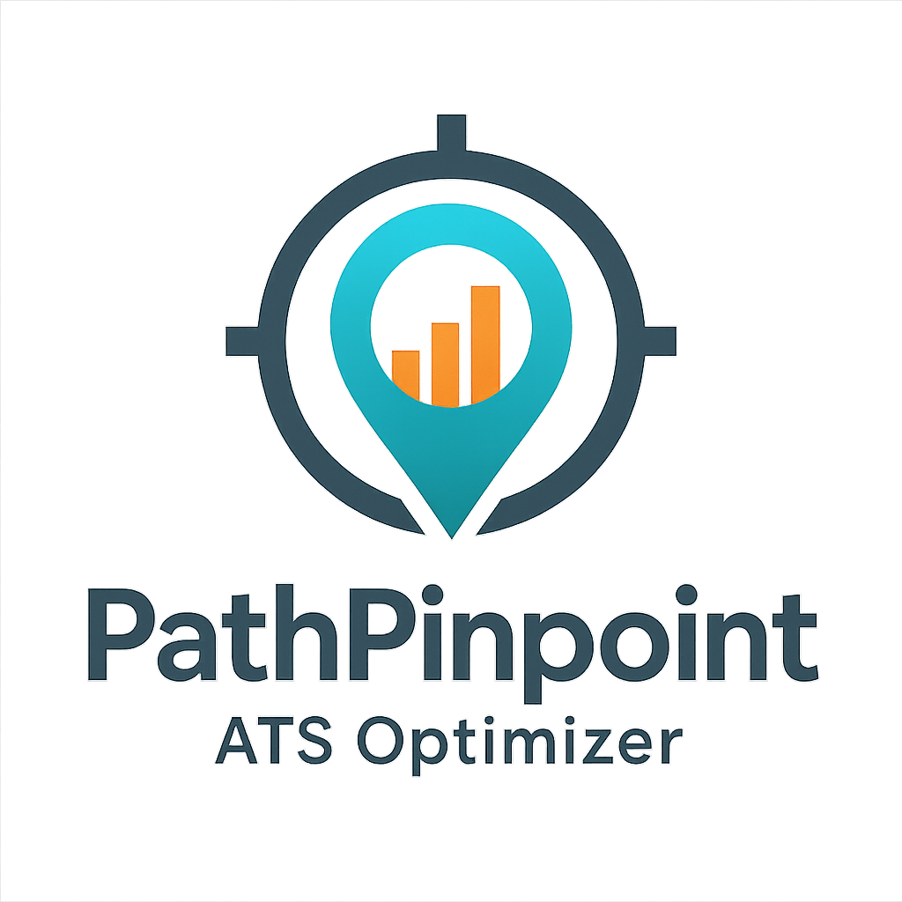

<p align="center">
  
</p>

# 📍 PathPinpoint  
**The AI-Powered ATS Resume Optimizer**  

> Instantly score your resume against any job description, get laser-focused feedback, and download polished, tailored documents to land more interviews.

---

## 🔖 Table of Contents
1. [Why PathPinpoint?](#why-pathpinpoint)  
2. [Key Features](#key-features)  
3. [Tech Stack](#tech-stack)  
4. [Prerequisites](#prerequisites)  
5. [Installation & Setup](#installation--setup)  
6. [Running the App](#running-the-app)  
7. [How to Use](#how-to-use)  
8. [Project Structure](#project-structure)  
9. [Troubleshooting](#troubleshooting)  
10. [Connect & Support](#connect--support)

---

## 🎯 Why PathPinpoint?
Recruiters use Applicant Tracking Systems (ATS) to filter resumes in seconds.  
PathPinpoint empowers you to **beat the bots** and **speak the recruiters’ language**, by:
- **Quantifying** your fit with a clear “Match %” score  
- Exposing **missing keywords** you need to add  
- Generating **tailored** resume + cover letter in one click  
- Suggesting **interview questions** and **skill-gap** fixes  

---

## ✨ Key Features
- **ATS Match Score**  
  A 1–100% measure of how well your resume aligns with the job description.
- **Keyword Gap Analysis**  
  Highlight missing terms & skills recruiters expect to see.
- **Profile Summary & Tone**  
  AI-crafted bullet points to sharpen your professional narrative.
- **AI-Tailored Resume**  
  Reformatted, keyword-optimized resume ready to download (PDF & DOCX).
- **One-Page Cover Letter**  
  Custom cover letter that echoes the JD’s language and your achievements.
- **Interview Prep**  
  Five likely questions based on the JD to practice with.
- **Skill-Gap Recommendations**  
  Pinpoint which certifications or courses will boost your profile.
- **Related Roles & Salary Insights**  
  Explore similar job titles and get a ballpark salary range.
- **Networking Tips**  
  Quick suggestions on who to connect with and conversation starters.

---

## 🛠️ Tech Stack
- **Frontend & UI**: [Streamlit](https://streamlit.io/)  
- **LLM Backend**: Google Gemini API via `google-generativeai`  
- **PDF Generation**: [FPDF](https://pypi.org/project/fpdf/)  
- **Word Docs**: [`python-docx`](https://python-docx.readthedocs.io/)  
- **Data & Utilities**: `PyPDF2`, `pandas`, `difflib`  
- **Configuration**: `.env` with [`python-dotenv`](https://pypi.org/project/python-dotenv/)  

---

## 🔧 Prerequisites
- **Python 3.10+**  
- A free [Google Cloud](https://console.cloud.google.com/) account with **Generative AI** enabled  
- **API Key** for Google Gemini (Gemini Pro / Gemma model)

---

## ⚙️ Installation & Setup

1. **Clone the repository**  
   ```bash
   git clone https://github.com/ubparmar/PathPinpoint-ATS-Optimizer.git
   cd PathPinpoint-ATS-Optimizer
   pip install requirements.txt
   streamlit run app.py
